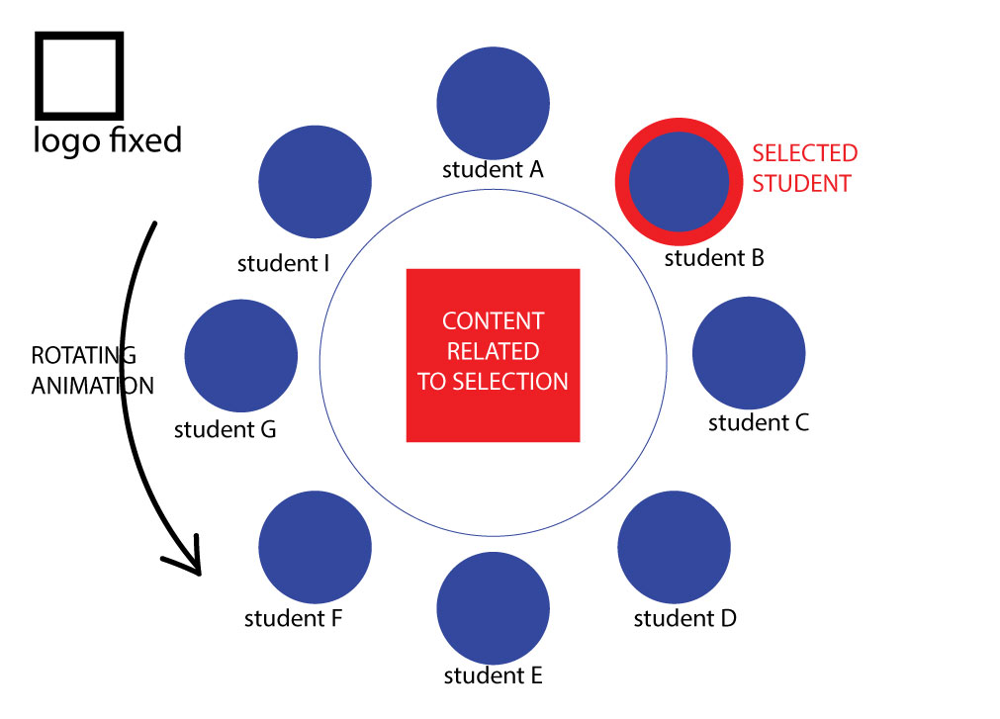

# allaboutocad.github.io
Web + Mobile Systems Design - Assignment B  
Group: Feng, Yiyi & Jad

## Inspirations  
**Yiyi:**  
Webgl Particle Audio Visualizer https://experiments.withgoogle.com/webgl-particle-audio-visualizer
Twitter Matrix
https://experiments.withgoogle.com/twitter-matrix  
Multisensory VR
https://experiments.withgoogle.com/light-maevr  
P5.play - javascript library
http://p5play.molleindustria.org/  
Pixi.js - javascript library
http://www.pixijs.com/  

**Feng:**  
-What we can build  
Song maker: https://musiclab.chromeexperiments.com/Song-Maker/  
Scan Sequencer Javascript: https://experiments.withgoogle.com/scan-sequencer  
3D Periodic Table: https://experiments.withgoogle.com/3d-periodic-table   
-Source code and visual style  
The Chaos Game: https://experiments.withgoogle.com/the-chaos-game  
Particle Love: https://experiments.withgoogle.com/particle-love  
Distort: https://experiments.withgoogle.com/distort  

**Jad:**  
Research : Interesting Webgl example : http://nouvellevague.ultranoir.com/

- *Idea 1* 
A responsive layout with scrolling parallax including a floating fixed menu + scrolling 3 sections such as this example:https://keithclark.co.uk/articles/pure-css-parallax-websites/demo3/ to represent the three of us as seen below:
  

- *Idea 2* << ** FINAL IDEA ** >>  
A responsive and unique Circular layout inspired from the universe CSS animation found on https://codepen.io/kowlor/pen/ZYYQoy?editors=0100
This would be a one page website that is responsive, interactive and animated. The center is dedicated to show all the details relatged to a selected student. The students are represented as rotating circles around the center of the page.
preview below:
  

